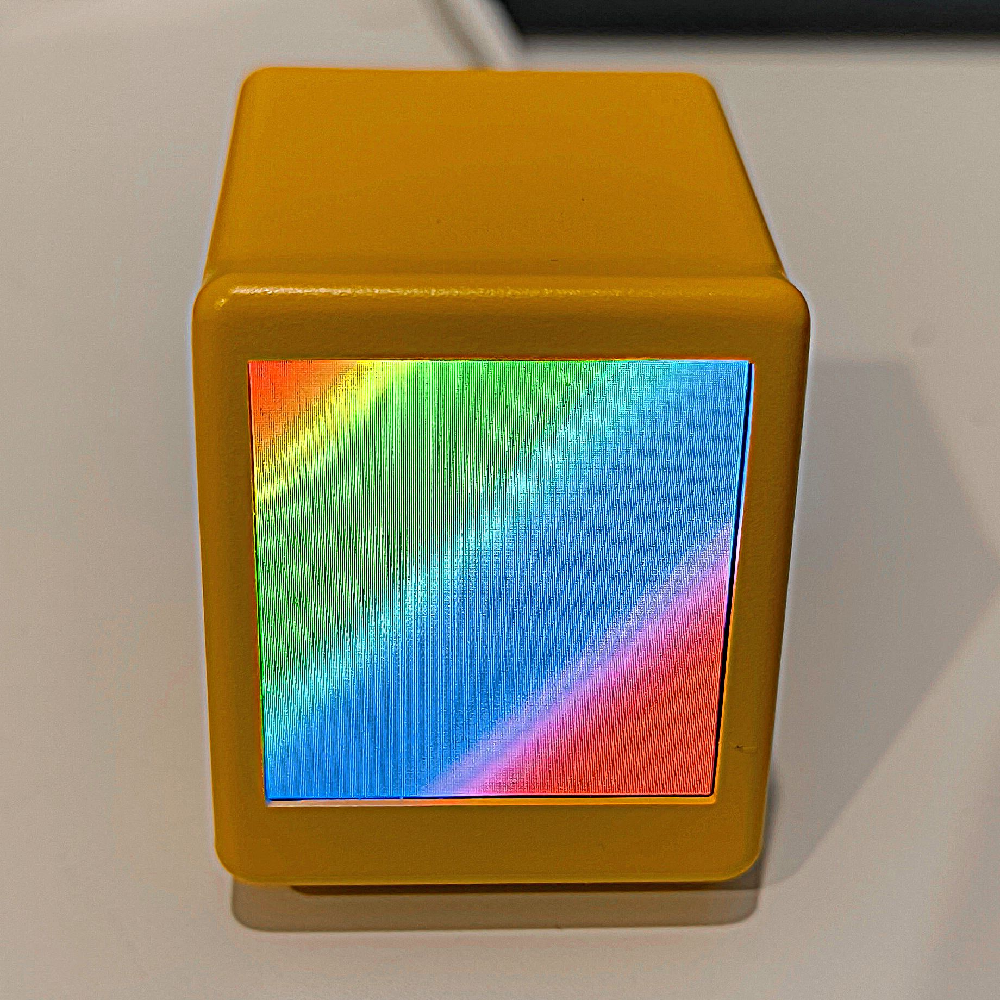

# SmallTV Image Display

This project is a firmware for [SmallTV](https://github.com/GeekMagicClock/smalltv) (GEEKMAGIC Smart Weather Clock) ESP8266-based TFT display module to display any 240x240 RGB image from Web Server.

This project is mainly intended to use in conjenction with my [QR code display Telegram bot](https://github.com/itpcc/qr-display-telegram-bot) project.



## Features

Mainly, it connect to configured WiFi, then, prediocally, it will fetch the latest version of the image from configured Web Server and display it on the display for specified time then turn the display off.

## Requirements

- SmallTV ([Shopee](https://shopee.co.th/artexlife/27367545865), [AliExpress](https://www.aliexpress.com/item/1005004679769445.html))
- USB-C Cable

## Installation

1. Install VSCode with [PlatformIO extension](https://docs.platformio.org/en/latest/platforms/espressif8266.html).
2. In [`platformio.ini`](./platformio.ini), Change `upload_port` to the one the device is connected.
3. In `src` folder, create `credentials.hpp` with the following values

    ```cpp

    #ifndef _SMALLTV_QR_CREDENTIAL_
    #define _SMALLTV_QR_CREDENTIAL_

    #define WIFI_SSID "<WiFi SSID>"
    #define WIFI_PASSWORD "<WiFi Password>"
    #define SERVICE_PATH "http://<IP/Domain Name>"
    #define SERVICE_PORT 80
    #define SERVICE_TOKEN "<Authorization token>"

    #endif

    ```

4. build and uploda to the device!

## [License](./LICENSE)

## Resources

- [GreatScott's review video about SmallTV](https://youtu.be/bvLeIsqz1zc?t=262)
- [Home Assistant Forum discussion](https://community.home-assistant.io/t/installing-esphome-on-geekmagic-smart-weather-clock-smalltv-pro/618029/1)
- [LeafMinter GitHub project](https://github.com/matteocrippa/leafminer)
- [Bodmer's TFT_eSPI library](https://github.com/matteocrippa/leafminer)
